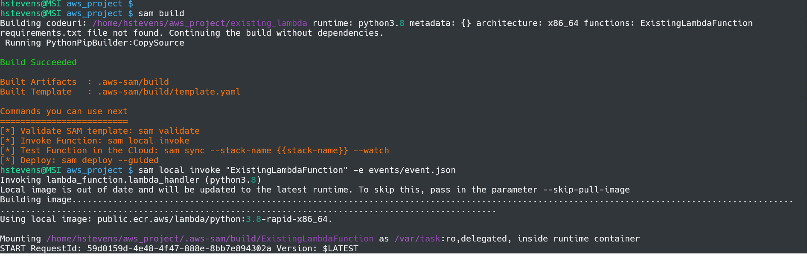

# AWS SAM Credit Card Clearinghouse

This is my local repository for a simulated, point-of-sale to clearinghouse to bank system, project made using AWS services. The project started out in the AWS lambda cloud environment, but I have transitioned to this local first setup. Doing so I can still use all of lambdas services from the comfort of my own machine. Using SAM I can modify and test my lambda function locally and automatically deploy changes to the cloud lambda function.

Relevant Technologies:
* AWS Lambda
* IAM
* DynamoDB
* AWS CLI
* SAM

Look at [sam_local_instructions.md](./sam_local_instructions.md) for information on how to get a local testing environment set up for your AWS Lambda function

